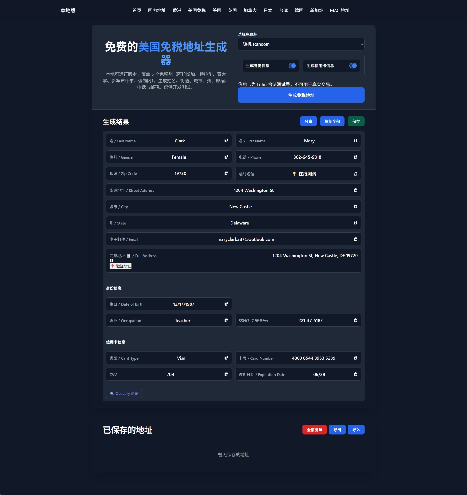
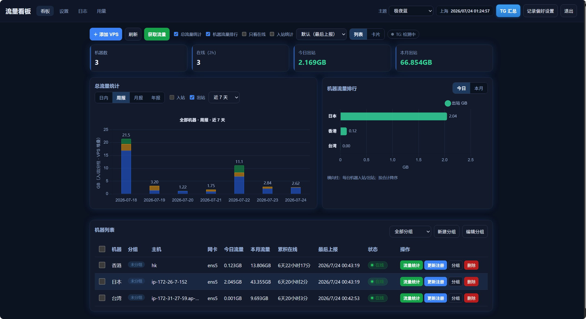

这篇文章记录几个**用 AI 辅助编程真正跑起来的落地项目**——不是 demo 玩具，而是解决自己场景的小系统。目前收录两个：

1. **VirtualAddress**：多国家/地区测试地址与数据生成（可在线体验）  
2. **CF 看板**：多 VPS 流量集中管理 + Telegram 汇总  

---

## 项目一：VirtualAddress · 虚拟地址与测试数据生成

| 项 | 内容 |
| --- | --- |
| 一句话 | 多国家/地区地址与测试数据生成（纯前端 + 静态托管） |
| 技术栈 | 静态 HTML/CSS/JS、JSON 数据分片、Cloudflare Workers Assets |

### 在线体验

> **立即打开：** [https://virtualaddress.2n.cc.cd/](https://virtualaddress.2n.cc.cd/)  
> 无需注册、无需 API Key，浏览器直接生成与校验测试地址。

> **网络说明：** 首页与「国内地址」会请求**境外地理 API**（如 OpenStreetMap 等）。若在国内直连失败、一直加载或无法反查，请**先科学上网**再使用。  
> 其余国家/地区页主要用站内 JSON 分片本地生成，一般不依赖上述境外接口。



> 上图为在线演示站截图：多国家入口、地址卡片与复制 / 地图验证等操作。

### 解决什么问题

开发、联调、填表测试时，经常需要**看起来像真的、又不能当真用的**地址和测试身份数据。VirtualAddress 在浏览器本地生成，数据 JSON 分片托管，无重型构建，适合挂在 CF Workers 或任意静态主机上。

> **仅供开发 / 测试。** 生成的身份与卡号为虚构或测试格式，不可用于欺诈或绕过任何真实业务核验。

### 架构亮点：真实性校验，而不是「随机字符串」

和随便拼几个门牌不同，这个项目把**「生成结果能不能被当成合理地址」**当成产品核心：

| 亮点 | 说明 |
| --- | --- |
| **居民住宅判定** | 按 IP 附近随机取点并反查时，优先保留**含街道 / 门牌**的结果，并给出是否住宅的说明徽章 |
| **地图坐标验证** | 每条结果可附 **Google 地图落点链接**，人工一眼核对位置是否合理（打开地图链接时同样可能需要可访问 Google 的网络环境） |
| **OSM 地理数据** | 基于 OpenStreetMap 反查，**无需自备地图 API Key**；代价是部分能力依赖境外服务可达 |
| **区域真实数据分片** | 美国州、日本都道府县等 JSON 分片加载，生成更贴合当地结构，而不是全球一套假模板 |
| **字段级自洽** | 测试信用卡等采用 **Luhn 合法测试号**；MAC 支持生成与 OUI 解析，方便联调网络/表单场景 |
| **中英地址转换** | 中文地址转英文（OSM），方便对接英文表单测试 |

一句话：**生成 → 规则过滤 / 住宅判定 → 地图可验证**，闭环比「只吐假数据」完整。

### 主要功能

- **多国家/地区地址生成**：美 / 英 / 加 / 日 / 中 / 港台 / 德 / 新等入口  
- **美国免税州演示**、日本都道府县等区域数据  
- **身份与测试信用卡**、**MAC 生成与 OUI 解析**  
- **首页 / 国内页**：出口 IP 附近住宅检索、中文转英文（**依赖境外 API，需科学上网**）  
- 结果卡片一键复制 + 地图验证  

### 架构简述

- **纯前端静态资源**（页面 + JSON 分片），**零构建**即可部署  
- CF 部署时由轻量 Worker 做旧路径 301、缓存与安全头  
- 也可 Vercel 静态或 VPS + Nginx  

### 再体验一次

**在线地址：** [https://virtualaddress.2n.cc.cd/](https://virtualaddress.2n.cc.cd/)  

再次提醒：首页 / 国内相关能力请在**可访问境外 API** 的网络下使用。

---

## 项目二：CF 看板 · 多 VPS 流量日报

| 项 | 内容 |
| --- | --- |
| 一句话 | 多台 VPS 的流量集中看板 + Telegram 汇总 / 日报 |
| 技术栈 | Cloudflare Workers、D1、VPS 侧 vnStat 定时上报、Telegram Bot |
| 预览 | 看板需登录鉴权，**不开放公网演示**；界面效果见下方截图 |



> 上图为本地/私有环境截取的 Web 看板界面，含机器列表、总流量统计与日/周/月/年切换。

### 解决什么问题

机子一多，每台 VPS 的流量、是否在线、今日/本月用量，单靠 SSH 或各机独立脚本很散。CF 看板把数据收到 **Cloudflare Worker + D1**，浏览器里统一看，并可选 **Telegram** 收汇总与离线告警。

### 架构亮点：省流 + 免费套餐友好

这是本项目最在意的约束——**在 Cloudflare 免费额度里也能长期跑**，而不是一上线就打满请求与 D1 写入。

| 亮点 | 说明 |
| --- | --- |
| **无长连接、无全局轮询** | 平时只有 VPS → Worker 的定时上报；不做「前端每秒刷一次」的高开销模式 |
| **主动上报为主** | 默认约每小时一次；`cron` 可调成每 2 / 6 小时或每天一次，**越疏越省** |
| **按需补点** | 「获取流量」才回调机器拉一次，不必把定时器打到分钟级 |
| **报表按场景选密度** | 周/月/年看累计快照，通常每小时或每几小时足够；只有要看「日内折线」才需要更密 |
| **D1 集中、无自建数据库** | 不占 VPS 上的 MySQL/Redis；Worker + D1 同属 CF 免费档常见组合 |
| **单机密钥隔离** | 每台 `access_token` 独立，泄露一台只换一台，降低全站重装成本 |

粗算量级（仅上报链路，每台）：

| 上报频率 | 约调用 / 台 / 天 |
| --- | --- |
| 每小时（默认） | ~24 |
| 每 2 小时 | ~12 |
| 每 6 小时 | ~4 |
| 每天 1 次 | ~1 |

机器数 × 上表 ≈ 日请求量；再叠 TG 定时汇总、偶发「获取流量」，一般仍远低于「实时监控类」产品的调用密度，**个人几台～十几台 VPS 用免费套餐通常够用**。

### 两种用法

| 方案 | 适合谁 | 是否需要 CF / 看板 |
| --- | --- | --- |
| **仅 TG 日报** | 只想每天在 Telegram 收到各机流量 | 不需要；VPS 直连 Bot，**零 CF 费用** |
| **CF 看板** | 要 Web 管理、多机列表、历史曲线、离线告警、统一 TG 汇总 | Worker + D1（可跑免费档） |

### 主要功能（看板）

- **机器列表**：今日 / 本月流量、在线状态、批量操作与排序筛选  
- **总流量统计**：日内折线、近 7 天 / 30 天 / 12 月报表，入站 / 出站可选  
- **单机流量**：行内弹窗看详情  
- **获取流量**：向 VPS 主动拉取（需回调端口可达）  
- **TG 汇报**：卡片 / 今日排行 / 详细等模板，定时或立即发送  
- **离线告警**：掉线通知一次，恢复后清标记  
- **安全**：密码门登录；同 IP 短时多次失败会锁定  

### 数据流

```
VPS（vnStat + 定时任务）──稀疏上报──▶ Cloudflare Worker + D1
                                           │
                              Web 看板 ◀───┤
                                           └──▶ Telegram 汇总 / 告警
```

---

## 和「AI 编程」的关系

两个项目都是**边写边用 AI 协作**落地的：人定约束（真实性可校验 / 省流 / 免费额度 / 仅测试用途），模型加速实现与文档，再在真实环境验通。重点不是堆功能，而是**架构取舍说得清、线上跑得住**。

后续若有更多落地项目，会按同一结构继续补在本系列。
